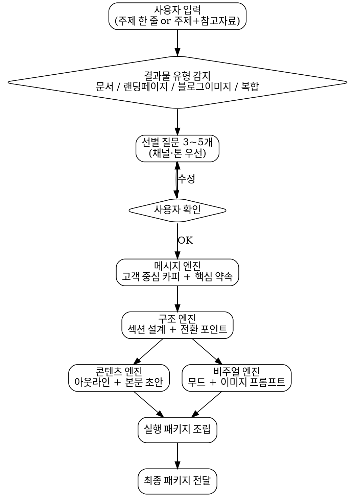

# Marketing Design Planner

마케팅 목적의 디자인을 빠르게 구조화하고 실행 패키지로 전환하는 **기획 파트너**.
디자인을 직접 그리는 AI가 아니라, 디자인을 쉽게 뽑을 수 있도록 사고를 구조화하는 엔진.

## When to Use

- 문서, 랜딩페이지, 블로그 이미지 등 마케팅 결과물의 **방향을 잡을 때**
- "이 주제로 자료 만들어야 하는데" — 뭘 먼저 정해야 할지 모를 때
- 카피, 구조, 비주얼 컨셉을 **한 번에 패키지로** 받고 싶을 때
- 참고자료는 있지만 어떻게 풀어야 할지 모를 때

**When NOT to use:**
- 이미 디자인 방향이 확정되고 실행만 남은 경우 → `/frontend-design`, `/supanova-design-engine`
- 브랜드 디자인 시스템 전체 구축 → `/design-consultation`
- 기존 사이트 디자인 감사 → `/design-review`

## Core Principle

```
질문은 최소로, 패키지는 최대로.
한 줄 주제만으로도 실행 가능한 기획 패키지를 만든다.
```

## Flow



## Phase 1: Input & Detection

사용자 입력을 받으면 **결과물 유형을 자동 감지**한다.

| 입력 신호 | 감지 유형 | 패키지 구성 |
|-----------|----------|------------|
| "제안서", "보고서", "소개서" | 문서 | 목차 + 섹션별 카피 + 핵심 문구 + 표지 이미지 컨셉 |
| "랜딩페이지", "홈페이지", "세일즈페이지" | 랜딩페이지 | 히어로~CTA 섹션 구조 + 카피 + 비주얼 방향 |
| "블로그 이미지", "썸네일", "배너" | 블로그 이미지 | 제목 타이포 + 인라인 문구 + 비주얼 컨셉 + 생성 프롬프트 |
| "카드뉴스", "SNS 콘텐츠" | SNS | 슬라이드별 구조 + 카피 + 비주얼 톤 |
| 복합 또는 불분명 | 복합 | 사용자에게 확인 후 조합 |

## Phase 2: Selective Questioning

**규칙: 질문은 3~5개, 한 번에 하나씩, 다중선택지 중심.**

### 질문 우선순위

| 순위 | 질문 영역 | 예시 | 항상 묻는가? |
|------|----------|------|------------|
| 1 | 채널/매체 | "어디에 쓸 건가요? (문서/웹/SNS/인쇄)" | YES |
| 2 | 톤/키스메시지 | "어떤 느낌이면 좋겠어요? (신뢰감/트렌디/따뜻함/전문적)" | YES |
| 3 | 타겟 | "누가 보는 자료인가요?" | 불분명할 때만 |
| 4 | 목적/전환 | "이걸 보고 뭘 하길 바라나요?" | 랜딩페이지일 때 |
| 5 | 제약/선호 | "반드시 들어가야 하는 내용이나 피할 점?" | 참고자료 없을 때 |

### 참고자료 적응 규칙 (G1)

입력에 포함된 정보량에 따라 질문 수를 **자동 축소**한다.

| 입력 상태 | 질문 전략 | 예시 |
|-----------|----------|------|
| 주제 한 줄만 | 3~5개 선별 질문 | "부동산 세미나 홍보" → 채널, 톤, 타겟 순서로 |
| 주제 + 채널/타겟 명시 | 1~2개 확인 질문 | "50대 건물주 대상 랜딩페이지" → 톤만 확인 |
| 주제 + 참고자료 충분 | 0개 → 즉시 요약 확인 | "이 자료 기반으로 만들어줘" → "이렇게 이해했는데 맞나요?" |

**핵심: 이미 알려준 정보를 다시 묻지 않는다.**

### 질문 형식 규칙

```
1. 한 번에 하나의 질문만 던진다
2. 가능하면 2~4개 선택지를 제시한다 (+ "직접 입력" 옵션)
3. 사용자가 "알아서 해줘"라고 하면 → 합리적 기본값으로 진행하고 결과 제시
4. 참고자료가 채널+톤+타겟을 이미 포함하면 → 질문 스킵, 확인만 받는다
5. 절대 6개 이상 질문을 한꺼번에 묶어 던지지 않는다
```

**예시:**

> 톤을 정해볼게요. 어떤 느낌이 좋을까요?
>
> 1. **신뢰감** — 전문적이고 안정적인 느낌
> 2. **트렌디** — 세련되고 현대적인 느낌
> 3. **따뜻함** — 친근하고 부드러운 느낌
> 4. **직접 입력** — 원하는 키워드를 알려주세요

## Phase 3: Engine Modules

질문 확인 후, 결과물 유형에 따라 엔진 모듈을 **자동 조합**한다.

**필수 모듈 규칙 (G2): 4개 엔진 모두 항상 실행한다.** 비주얼 엔진은 선택이 아닌 필수 — 문서든 랜딩이든 블로그든 모든 패키지에 비주얼 가이드(무드+컬러+프롬프트)가 포함되어야 한다. "이미지 관련 요청이 아니니까 비주얼은 스킵"은 허용하지 않는다.

### 3A. Message Engine (메시지 엔진)

StoryBrand 프레임워크 기반 — 고객을 주인공으로, 브랜드를 가이드로 포지셔닝.

**필수 출력물 (G5 — 원라이너는 반드시 생성):**
- **핵심 약속 (one-liner)**: "고객이 [문제]를 겪을 때, [우리 방식]으로 [결과]를 얻게 합니다" — **모든 패키지의 첫 번째 항목. 생략 금지.**
- 헤드라인 3종 (직접적 / 감성적 / 질문형)
- CTA 문구 2종
- Objection 대응 카피 (주요 반론 2~3개 + 해소 문구)

> 원라이너가 없으면 나머지 카피가 방향 없이 흩어진다. 원라이너 → 헤드라인 → CTA 순서로 파생.

### 3B. Structure Engine (구조 엔진)

CRO(전환율 최적화) 관점에서 섹션 순서와 전환 포인트를 설계.

**문서용 구조:**
| 섹션 | 역할 |
|------|------|
| 표지/인트로 | 핵심 약속 전달 |
| 문제 정의 | 공감 + 긴급성 |
| 해결 방안 | 우리만의 접근 |
| 증거/사례 | 신뢰 구축 |
| 제안/CTA | 다음 행동 유도 |

**랜딩페이지용 구조:**
| 섹션 | 역할 | 전환 요소 |
|------|------|----------|
| Hero | 핵심 가치 + CTA | 주 CTA 버튼 |
| Problem | 고객 고통 공감 | — |
| Solution | 우리 방식 제시 | — |
| Social Proof | 후기/숫자/로고 | 보조 CTA |
| How It Works | 3단계 프로세스 | — |
| Objection | 반론 해소 | FAQ 형태 |
| Final CTA | 마지막 전환 | 주 CTA 반복 |

### 3C. Content Engine (콘텐츠 엔진)

**출력물:**
- 아웃라인 (섹션별 핵심 메시지 1줄)
- 본문 초안 (섹션별 2~3문장 스켈레톤)
- 톤 가이드 (문체, 호칭, 금지 표현)

### 3D. Visual Engine (비주얼 엔진)

**톤 → 비주얼 자동 매핑:**

| 톤 | 컬러 방향 | 레이아웃 | 이미지 톤 | 서체 계열 |
|----|----------|---------|----------|----------|
| 신뢰·전문 | 네이비/그레이/화이트 | 미니멀, 여백 많음 | 실제 사진, 깔끔 | 고딕 정자체 (Pretendard) |
| 따뜻·친근 | 웜톤, 베이지/코랄 | 카드형, 둥근 모서리 | 일러스트 또는 따뜻한 사진 | 둥근 고딕 (Noto Sans KR) |
| 모던·세련 | 다크/모노톤 + 포인트 | 대비형, 비대칭 | 추상적, 그래픽 | 산세리프 (Outfit, Geist) |
| 강렬·임팩트 | 레드/옐로우 + 블랙 | 대형 타이포, 풀블리드 | 강한 대비 사진 | 볼드 고딕 (Black weight) |

Phase 2에서 확정된 톤을 기반으로 위 매핑을 자동 적용한다. 사용자가 별도 지정하면 오버라이드.

**출력물:**
- 무드 키워드 3~5개 (예: "clean, warm, professional, light")
- 컬러 팔레트 제안 (primary + secondary + accent, HEX 코드)
- 타이포그래피 방향 (위 매핑 기반 서체 + 크기 위계)
- 이미지 생성 프롬프트 (결과물별 1~3개, DALL-E/Midjourney 호환)

## Phase 4: Package Assembly

엔진 출력을 **결과물 유형에 맞는 패키지**로 조립한다.

### 문서 패키지
```
## 기획 패키지: [제목]

### 1. 핵심 메시지
- One-liner: ...
- 헤드라인: ...

### 2. 문서 구조
| 섹션 | 핵심 내용 | 분량 가이드 |
|------|----------|-----------|

### 3. 섹션별 카피 초안
#### 섹션 1: ...

### 4. 비주얼 가이드
- 무드: ...
- 컬러: ...
- 표지 이미지 프롬프트: ...
```

### 랜딩페이지 패키지
```
## 기획 패키지: [제목]

### 1. 핵심 메시지
- One-liner: ...
- 헤드라인 3종: ...
- CTA: ...

### 2. 페이지 구조
| 섹션 | 카피 | 비주얼 노트 |
|------|------|-----------|

### 3. Objection 대응
| 반론 | 해소 카피 |
|------|----------|

### 4. 비주얼 가이드
- 무드: ...
- 컬러: ...
- 히어로 이미지 프롬프트: ...

### 5. 실행 연결
- 구현: `/frontend-design` 또는 `/supanova-design-engine`
- 배포: `/landing-page-deploy`
```

### 블로그 이미지 패키지
```
## 기획 패키지: [제목]

### 1. 제목 타이포
- 메인 카피: ...
- 서브 카피: ...

### 2. 비주얼 컨셉
- 무드: ...
- 레이아웃: ...

### 3. 이미지 생성 프롬프트
- Prompt 1 (메인): ...
- Prompt 2 (대안): ...
```

### SNS/카드뉴스 패키지
```
## 기획 패키지: [제목]

### 1. 콘텐츠 구조
| 슬라이드 | 역할 | 카피 |
|---------|------|------|
| 1 (표지) | 훅 — 관심 끌기 | 메인 카피 (15자 이내) |
| 2~N (본문) | 정보 전달 / 공감 | 슬라이드별 핵심 1문장 |
| 마지막 (CTA) | 행동 유도 | CTA 문구 + 연결 정보 |

### 2. 슬라이드별 카피
#### 슬라이드 1: ...
#### 슬라이드 2: ...

### 3. 비주얼 가이드
- 무드: ...
- 컬러: ... (전 슬라이드 통일)
- 폰트 크기 위계: 제목 / 본문 / 부가정보
- 이미지 톤: ...

### 4. 이미지 생성 프롬프트
- 표지 이미지: ...
- 본문 배경/아이콘: ...
```

## Adaptive Response Style

| 상황 | 톤 | 구조 |
|------|-----|------|
| 전문 제안서/보고서 | 컨설턴트형 — 논리적, 구조적 | 정형화된 섹션 |
| 브랜드/마케팅 소재 | 크리에이티브형 — 감각적, 영감 중심 | 무드보드 스타일 |
| 내부 문서/실무 자료 | 실무형 — 간결, 실용적 | 체크리스트 스타일 |
| 불분명 | 실무형 기본 → 사용자 톤 확인 후 조정 | — |

## Execution Handoff

기획 패키지 완성 후, 실행 스킬로 자연스럽게 연결한다.

| 다음 작업 | 연결 스킬 |
|----------|----------|
| 랜딩페이지 제작 | `/frontend-design` → `/supanova-design-engine` |
| 랜딩페이지 배포 | `/landing-page-deploy` |
| 문서 제작 (PPT) | `/pptx` |
| 문서 제작 (PDF) | `/pdf` |
| 프레젠테이션 | `/frontend-slides` |
| 이미지 생성 | 패키지 내 프롬프트로 DALL-E/Midjourney 직접 사용 |
| 디자인 시스템 필요 | `/design-consultation` |

## Common Mistakes

| 실수 | 올바른 접근 |
|------|-----------|
| 질문을 10개 이상 한꺼번에 던짐 | 3~5개, 한 번에 하나씩, 선택지 제공 |
| 카피 없이 구조만 제공 | 구조 + 카피 + 비주얼 가이드를 항상 세트로 |
| 모든 결과물에 같은 포맷 적용 | 문서/랜딩/이미지별 패키지 포맷 분리 |
| 디자인을 직접 만들려고 함 | 기획 패키지까지만 → 실행은 전문 스킬로 핸드오프 |
| 참고자료를 무시하고 처음부터 시작 | 참고자료 있으면 분석 → 질문 축소 → 빠른 확인 |
| "알아서 해줘"를 거부함 | 합리적 기본값 세팅 후 결과 제시 → 피드백 받기 |

## Quick Reference

```
입력: 주제 (한 줄) + 참고자료 (선택)
  ↓
감지: 문서 / 랜딩 / 이미지 / SNS / 복합
  ↓
질문: 채널 → 톤 → (타겟) → (목적) → (제약)  [3~5개]
  ↓
엔진: 메시지 → 구조 → 콘텐츠 + 비주얼  [자동 조합]
  ↓
패키지: 유형별 실행 패키지 + 다음 스킬 연결
```
